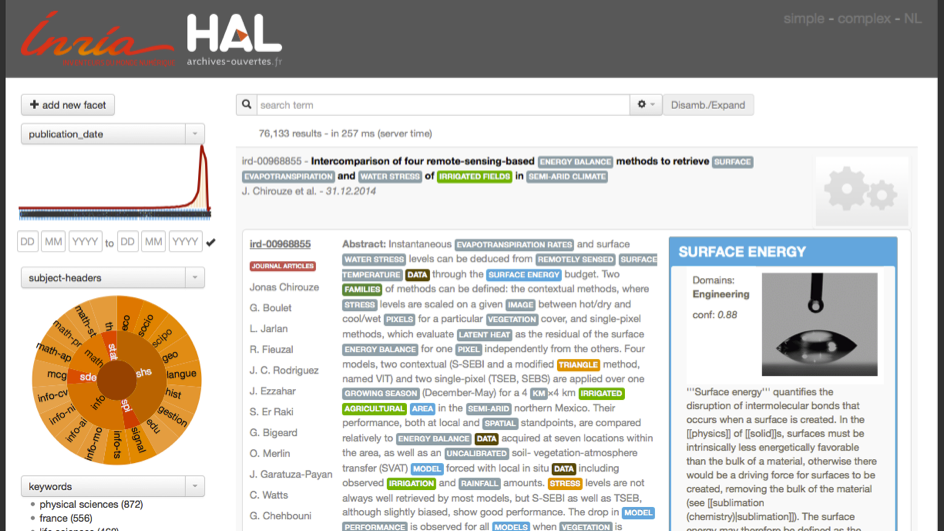
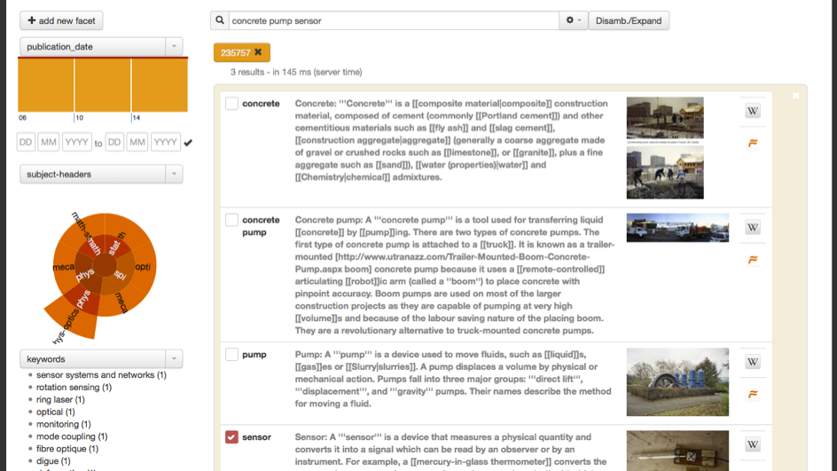

# AnHALytics Frontends

AnHALytics is a project aiming at creating an analytic platform for the [HAL research archive](https://hal.archives-ouvertes.fr) or other scientific Open Access repositories, exploring various analytic aspects such as search/discovery, activity and collaboration statistics, trend/technology maps, knowledge graph and data visualization. The project is supported by an [ADT Inria](http://www.inria.fr/en/research/research-teams/technological-development-at-inria) grant and good will :). 

This module is dedicated to the frontends of the system. 

*Above: View of anHALytics search and discovery front end*

*Above: Example of query disambiguation in the anHALytics search and discovery front end*

## License

This code is distributed under [Apache 2.0 license](http://www.apache.org/licenses/LICENSE-2.0). 

## Warning

AnHALytics is a work at early stage and a work in progress. It is evolving rapidly and is certainly not production ready! 

## People

- Achraf Azhar
- [Patrice Lopez](https://github.com/kermitt2) 

If you are interested in contributing to the project, please contact <patrice.lopez@inria.fr>. 

